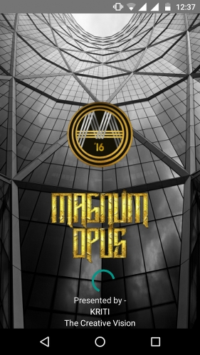

# Magnum Opus - IET Lucknow Official CSE Fest App
 
<a href="https://play.google.com/store/apps/details?id=com.ietkriti.abhishek.magnumopus&hl=en"></a>

## To use source code : 
1. Clone Repository <br>
```git clone https://github.com/ft-abhishekgupta/android-event-app-magnumopus```
1. Open Repository in Android Studio
1. Sync Project and Install Required Dependencies
1. Build and Run Project.

## App Description
 
Computer Science and Engineering Department of IET Lucknow, in association with the KRITI Society organizes one of the most awaited festival every year. It’s back to fill the air with verve and excitement and force the adrenaline to rush through your veins!!

This time the fest is reaching new heights with the launch of Android Application to reach massive audience to witness the best departmental festival and to provide easy access to information about the festival.

The application allows you to have a sneak peek into this four days journey of the most intriguing and spine tingling experience.

Features :
* Detailed Description of each event
* Visually stunning graphics
* Easy UI design
* Provisional Schedule of entire festival
* Notification Section to receive timely updates for the events
* Notification includes result announcements , schedule changes , and other important announcements
* Direct links to website , FB pages , Youtube channels , Google maps
* List of the all the team members with profile pictures
* Team members can directly be contacted through the application via calls and sms
* Has about section for the curious minds who want to know more about the festival
* Has contact section for those who want to connect with us
* Links to every section of the app through navigation drawer

Technical Team has made their best efforts to make this festival one of its kind . The application will assist the managing team in its work at the same time allowing the participants to get a vivid description of the festival.
Looking forward to your association with Kriti 2K16.

**Rate and Share the App if you like it.**
## Screenshots



